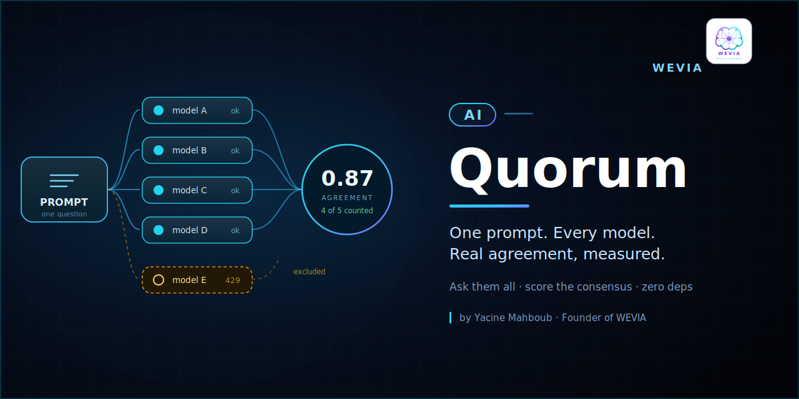

<p align="center"></p>

<h1 align="center">AI Quorum</h1>
<p align="center"><b>One prompt. Every model. Real agreement, measured.</b></p>
<p align="center">Ask them all &nbsp;·&nbsp; score the consensus &nbsp;·&nbsp; zero dependencies</p>


---

## Why

One model gives you an answer with false confidence. Several models give you a **distribution** — and the shape of that distribution is the information you actually needed.

Quorum sends the same prompt to every model you configure, in parallel, then measures how much their answers genuinely overlap. High agreement means you can trust it. Low agreement means the question is contested — exactly the case a single model would have hidden from you.

Created by **Yacine Mahboub**, Founder of WEVIA.

## 30 seconds

```python
from consensus_lens import Lens, Provider

lens = Lens([
    Provider("model-a", call=ask_model_a),
    Provider("model-b", call=ask_model_b),
    Provider("model-c", call=ask_model_c),
])

r = lens.ask("Assess the risk of this migration plan.")

print(r.consensus)   # 0.87
print(r.level)       # "strong"
```

```
consensus=0.87  level=strong  counted=3/3
  model-a    412ms  counted
  model-b    690ms  counted
  model-c    533ms  counted
```

A provider that rate-limits, times out, or returns nothing is recorded as such and **excluded from the vote** — never retried silently, never faked to keep the numbers pretty.

## What you get

- **Parallel fan-out** with per-provider timeouts. One slow model never blocks the rest.
- **Honest degradation.** A 429 is reported as a 429. Failures never enter the score.
- **Consensus scoring.** Pairwise token overlap across answers, aggregated into one number.
- **A verdict you can act on** — `strong` / `partial` / `divergent` / `insufficient`.

## What it deliberately doesn't do

- It never picks a winner. Consensus is a measurement, not a verdict.
- It ships **no providers, no credentials, no endpoints**. You wire your own — see [`providers/`](providers/).
- No dependencies. Standard library only.

## Try it now

```bash
git clone https://github.com/Yacineutt/AI-Quorum && cd AI-Quorum
python3 examples/mock_providers.py
```

Runs offline with mock models. Shows both cases that matter: models agreeing, and one provider failing while the vote continues honestly.

## Swap the scorer

Token overlap is the default because it is language-agnostic and has no dependencies. Replace `_tokens()` in [`src/consensus_lens.py`](src/consensus_lens.py) with embeddings or a semantic scorer — the interface stays identical.

## Related

**[AI ThreeAM](https://github.com/Yacineutt/AI-ThreeAM)** — the operational doctrines behind this design. Quorum is doctrine 3 (*honesty over fluency*) made executable.

## License

Apache-2.0.

---

<p align="center"><sub>Maintained by <a href="https://weval-consulting.com">WEVIA</a> — sovereign AI platform engineering.</sub></p>
